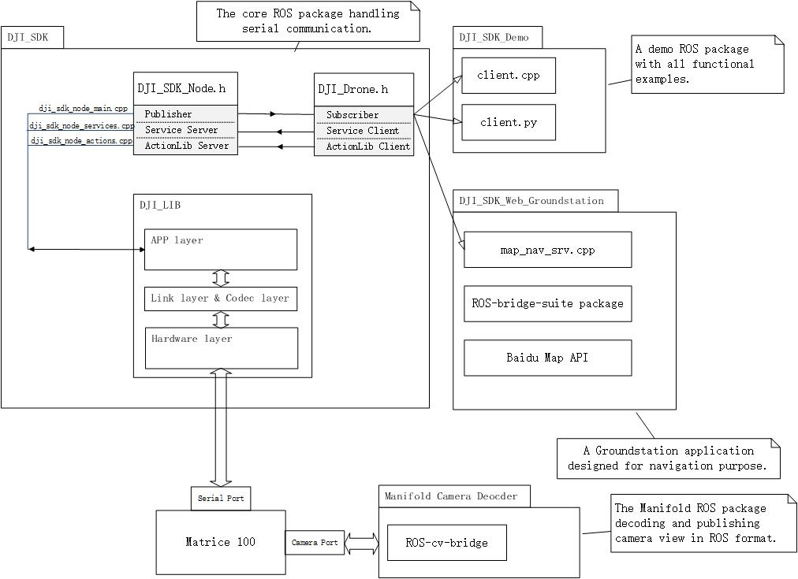

#### This documentation is now deprecated, please refer to <https://developer.dji.com/onboard-sdk/documentation/github-platform-docs/ROS/README.html> in DJI Developer Website.

#DJI Onboard SDK ROS Packages

----

**Attention: **

You can change your drone type between M100 and M600/A3 in the launch file directly, no matter whether you download the code from this repo or apt-get from ROS official repository.

Please refer to [our launch file](dji_sdk/launch/sdk_manifold.launch) for more detail.

##Introduction

This is a ROS package for DJI OnBoard SDK.

It helps users handle the following commands and actions.

* The activation
* The flight control obtainment
* The flight control release
* The take off procedure
* The landing procedure
* The go home procedure
* The Gimbal control
* The attitude control
* The photo taking procedure
* The start/stop video recording procedure
* The Virtual RC control
* The broadcast frequency control
* The arm/disarm control
* The timestamp synchonization procedure
* The native waypoint task implementation
* The hotpoint task implementation
* The follow-me task implementation
* Local navigation (fly into a certain (X,Y,Z))
* GPS navigation (fly into a certain GPS coordinate)
* Naive waypoint navigation (fly through a series of GPS coordinates)
* Using WebSocket together with Baidu Map for navigation 
* Using MAVLink protocol and QGroundStation

##How to use
1. Install and configure your hardware correctly.
2. Enter the following info into `dji_sdk/launch/sdk_manifold.launch`.
	* Drone Version ("M100" or "A3")
	* APP ID
	* Communication Key
	* Uart Device Name
	* Baudrate
3. Use `roslaunch dji_sdk sdk_manifold.launch` to start the core node.
4. Include the `dji_drone.h` from `dji_sdk/include/dji_sdk` into your package and run it. (there also provides a python version `dji_drone.py` in `dji_sdk/src/dji_sdk`)

##System Structure
* [dji_sdk](dji_sdk): the core package handling the communication with Matrice 100, which provides a header file `dji_drone.h` for future use
* [dji_sdk_demo](dji_sdk_demo): an example package of using `dji_drone.h` to control the Matrice 100
* [dji_sdk_web_groundstation](dji_sdk_web_groundstation): a WebSocket example using ROS-bridge-suite, where a webpage groundstatino is provided
* [dji_sdk_read_cam](dji_sdk_read_cam): a X3 video decoding package for Manifold, CATKIN_IGNOREd by defualt
* [dji_sdk_dji2mav](dji_sdk_dji2mav): a protocol converter making M100 compatiable with all MAVLink-protocol-dependent softwares
* [dji_sdk_doc](dji_sdk_doc): all documents

[click to see fullsize image](https://raw.githubusercontent.com/dji-sdk/Onboard-SDK-ROS/2.3/dji_sdk_doc/structure.jpg)

##Read First
[DJI SDK Challenge: Onboard SDK Part I](dji_sdk_doc/whatToKnowI.md)

##System Environment
The below environment has been tested.
* Operating System: Ubuntu 14.04, Manifold
* ROS version: ROS Indigo

---

#DJI Onboard SDK ROS例程

##简介

此ROS例程实现了以下功能：

* 激活 Matrice100 （以下简称M100）
* 获取 M100 控制权
* 释放 M100 控制权
* 向 M100 发送起飞指令
* 向 M100 发送降落指令
* 向 M100 发送返航指令
* 对 M100 进行姿态控制
* 对 M100 进行云台角度控制
* 向 M100 发送相机控制指令
* 向 M100 发送虚拟遥控指令
* 向 M100 发送锁定/解锁指令
* 向 M100 发送同步时间戳指令
* 设置 M100 外发数据频率
* 利用航点任务接口实现航点任务
* 利用热点任务接口实现热点任务
* 利用跟随任务接口实现跟随任务
* 控制 M100 进行 (x,y,z) 坐标导航
* 控制 M100 进行 GPS 坐标导航
* 通过姿态控制指令实现 M100 的航点飞行任务
* 通过 WebSocket 向 M100 发送网页地图生成的航点指令
* 通过 MAVLink 和 QGroundControl 控制 M100

##如何使用

1. 按照文档配置好 M100 
2. 将激活信息输入至launch file：`dji_sdk/launch/sdk_manifold.launch`
	* Drone Version （飞控版本：“M100” 或 “A3”）
	* APP ID （在官网注册key后得到）
	* Communication Key（在官网注册key后得到）
	* Uart Device Name（串口设备名称）
	* Baudrate（比特率）
3. 运行 `roslaunch dji_sdk sdk_manifold.launch` 来启动核心包。
4. 将 `dji_sdk/include/dji_sdk` 下的客户端头文件`dji_drone.h` 引用到你自己的 ROS 包中，并运行它（我们也提供了python版本的客户端`dji_drone.py`）

##系统架构
* [dji_sdk](dji_sdk): 核心 ROS 包，处理所有与 M100 的串口通信并提供了 `dji_drone.h`的头文件供开发者引用。
* [dji_sdk_demo](dji_sdk_demo): 一个调用 `dji_drone.h` 控制 M100 的例子。
* [dji_sdk_web_groundstation](dji_sdk_web_groundstation): 基于 WebSocket 的网页版地面站，依赖 ROS-bridge-suite 。
* [dji_sdk_read_cam](dji_sdk_read_cam): Manifold专用 ROS 包，对禅思 X3 云台的视频信息进行解码输出视频流。默认通过`CATKIN_IGNORE`禁用，需要手动启用。
* [dji_sdk_dji2mav](dji_sdk_dji2mav): MAVLink 协议转接器，使得 M100 可以支持任意使用 MAVLink 为协议的地面站软件。
* [dji_sdk_doc](dji_sdk_doc): 所有的文档与图片信息。

[点击查看大图](https://raw.githubusercontent.com/dji-sdk/Onboard-SDK-ROS/2.3/dji_sdk_doc/structure.jpg)

##Read First
[DJI SDK Challenge: Onboard SDK Part I](dji_sdk_doc/whatToKnowI.md)

#系统环境
此 ROS 包在如下系统中进行测试；
* 操作系统：Ubuntu 14.04， DJI Manifold
* ROS 版本：ROS Indigo
