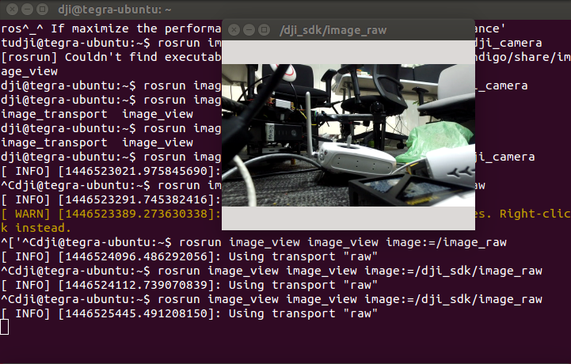
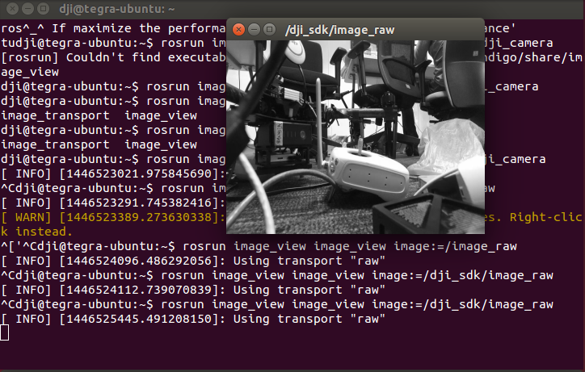

##DJI Onboard SDK ROS Package for Video Decoding on Manifold

This video-decoding package is desiged for Manifold to read the X3 video stream.

###How to use
1. Install the necessary library: refer [here](https://github.com/dji-sdk/manifold_cam)
2. Delete the `CATKIN_IGNORE` file inside package and `catkin_make`.
2. Modify the `manifold_cam.launch` in `launch` folder, set `gray_or_rgb` to 0 if the gray video stream is needed, or 1 if you prefer the RGB format; set `to_mobile` to 1 if you want to send the video to DJI GO or Mobile SDK APP.
3. `sudo -s` first, then `roslaunch dji_sdk_read_cam manifold_cam.launch`
4. The video will be published into topic `/dji_sdk/image_raw`

###If you want to work through SSH
(contributed by @groundmelon )

1. (Optional) Disable lightdm for stability:

	in `/etc/init/lightdm.conf`, line 12:

	Modify `runlevel [!06]` to `runlevel [!026]`

2. Add `xinit&` to a startup script, such as:

	```
	echo -e '#!/bin/bash\nxinit&' > /home/ubuntu/pre_x3
	chmod a+x /home/ubuntu/pre_x3
	```

	And add `/home/ubuntu/pre_x3` into `/etc/rc.local`

	**Note:** `ubuntu` is the user in this example, which should be replaced by your own. 

3. Add `export DISPLAY=:0` to your `.bashrc` or remember to set this environment variable to THE USER WHO WILL RUN THE CODE

4. (Maybe a reboot at first) Run the 4&5 in `How to use`.


###Note:
1. This package is specially designed for Manifold.
2. The RC controller must be connected to Matrice 100 in order to get the video stream.
3. The DJI Go has a power-saving strategy, which may prevent X3 from reading video. To avoid, developers should either enter the camera view in DJI Go or keep DJI GO closed from beginning. The video will be frozen if users stay in the main menu of DJI Go. 






	Note: the frame size is 640x480, no matter RGB or Grayscale
